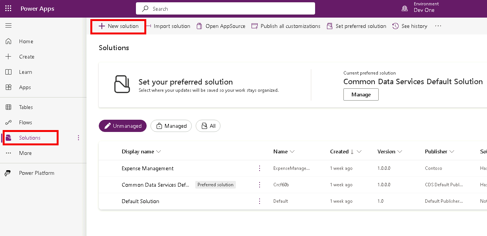
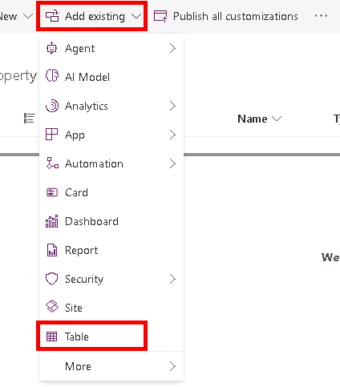
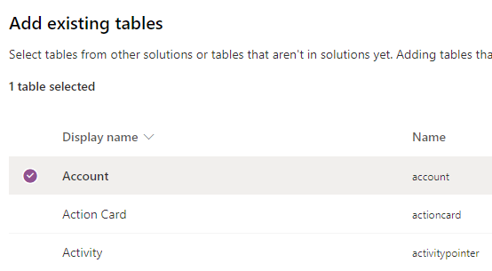

---
lab:
  title: "Laboratorio\_1: Publicador y solución"
  module: 'Module 1: Create tables in Dataverse'
---

# Laboratorio de práctica 1: Publicador y solución

## Escenario

En este laboratorio, creará un publicador y una solución.

## Aprendizaje

- Creación de una solución en Microsoft Dataverse
- Cómo agregar componentes existentes a una solución

## Pasos de alto nivel del laboratorio

- Crear un editor
- Creación de una solución de 
- Agregar tabla, columna, vista y formulario a la solución
  
## Requisitos previos

- Debe de haber completado la práctica **Laboratorio 0: Validación del entorno de laboratorio**

## Pasos detallados

## Ejercicio 1: Creación de un publicador y una solución

En este ejercicio, accederá al portal de Power Apps Maker, el entorno de Desarrolladores y creará una nueva solución.

### Tarea 1.1: Portal de Maker

1. En una nueva pestaña, vaya al portal de Power Apps Maker `https://make.powerapps.com` e inicie sesión con sus credenciales de Microsoft 365 si se le vuelve a solicitar.

1. Si se le solicita un **Número de teléfono**, escriba `0123456789` y seleccione **Enviar**.

1. Cambie los entornos mediante el Selector de entornos en la esquina superior derecha de la pantalla.

1. Seleccione el entorno **Dev One** de la lista.

    

1. Seleccione **Aplicaciones** en el panel de navegación izquierdo y después seleccione **Todas**. Debería ver en la lista varias aplicaciones, entre ellas, Dataverse Accelerator App, Solution Health Hub y Power Pages Management.

1. Seleccione **Tablas** en el panel de navegación izquierdo. Debería ver las tablas estándar de *Common Data Model*, incluidas las de Cuenta y Contacto.

### Tarea 1.2: Crear solución y publicador

1. Seleccione **Soluciones** en el panel de navegación de la izquierda. Debería ver varias soluciones, entre ellas la *Solución predeterminada* y la *Solución predeterminada de los servicios de datos comunes*.

    

1. Seleccione **+ Nueva solución**.

1. En el cuadro de texto **Nombre para mostrar**, escriba **`Property listings`**.

1. Compruebe que **Nombre** se rellena automáticamente.

1. Seleccione **+ Nuevo publicador** debajo del desplegable **Publicador**.

1. En **Nombre para mostrar**, escriba `Contoso Real Estate`.

1. En **Nombre**, escriba `contosorealestate`.

1. Para **Prefijo**, escriba `cre`.

    

1. Seleccione **Guardar**.

1. En la lista desplegable **Publicador**, seleccione **Contoso Real Estate (contosorealestate)**.

1. Seleccione **Crear**.

    

## Ejercicio 2: Adición de componentes a la solución

En este ejercicio, agregará una tabla existente a la solución.

### Tarea 2.1: Agregar tabla

1. Vaya al portal de Power Apps Maker `https://make.powerapps.com`.

1. Asegúrese de que está en el entorno **Dev One**.

1. Seleccione **Soluciones**.

1. Selecciona la solución **Listados de propiedades**, en el ejercicio anterior.

    

1. Seleccione **Agregar existente** y, luego, **Tabla**.

    

1. Seleccione la tabla **Cuenta**.

    

1. Seleccione **Siguiente**.

1. En la tabla **Cuenta**, seleccione el vínculo **Seleccionar objetos**.

1. En la pestaña **Columnas**, seleccione la columna **Número de cuenta**.

1. Seleccione la pestaña **Vistas**.

1. Seleccione la vista **Cuentas activas**.

1. Seleccione la pestaña **Formularios**.

1. Seleccione el formulario **Cuenta**.

1. Seleccione **Agregar**.

    > **Nota:** Debería haber seleccionado 1 vista, 1 formulario y 1 columna para la tabla **Cuenta**.

    

1. Seleccione **Agregar**.
