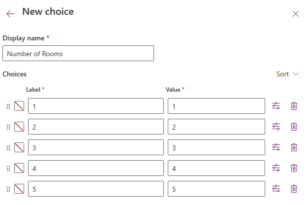

---
lab:
  title: "Laboratorio\_2: Modelo de datos"
  module: 'Module 1: Create tables in Dataverse'
---

# Laboratorio de práctica 2: Modelo de datos

## Escenario

En este laboratorio, creará tablas, columnas y relaciones de Dataverse.

Contoso Real Estate quiere realizar un seguimiento de dos elementos clave:

- Listados de propiedades inmobiliarias
- Quién tiene cita para visitar propiedades inmobiliarias

## Aprendizaje

- Procedimiento para crear de tablas en Dataverse
- Procedimiento para agregar columnas a tablas de Dataverse
- Procedimiento para crear relaciones entre tablas

## Pasos de alto nivel del laboratorio

- Crear tablas.
- Crear columnas
- Crear relaciones
  
## Requisitos previos

- Debe de haber completado la práctica **Laboratorio 1: Anunciante y solución**

## Pasos detallados

## Ejercicio 1: Crear tablas

En este ejercicio, creará y agregará tablas a la solución.

### Tarea 1.1: Crear tabla de propiedades inmobiliarias

1. Vaya al portal de Power Apps Maker `https://make.powerapps.com`.

1. Asegúrese de que está en el entorno **Dev One**.

1. Seleccione **Soluciones**.

1. Abra la solución **Descripciones de propiedades**.

1. Seleccione **+Nuevo**, luego seleccione **Tabla** y, a continuación, seleccione **Tabla (propiedades avanzadas)**.

    

1. En **Nombre para mostrar**, escriba `Real Estate Property`. El nombre plural se rellenará automáticamente.

1. Seleccione la pestaña **Columna principal**.

1. En **Nombre para mostrar**, escriba `Property Name`.

1. Expanda **Opciones avanzadas** y revise las opciones disponibles, pero no cambie nada aquí.

    

1. Seleccione la pestaña **Propiedades**.

1. Expanda **Opciones avanzadas**.

1. Consulte **Creación de una actividad**.

1. Compruebe **Aparece en los resultados de búsqueda**.

    

1. Seleccione **Guardar**.

1. Seleccionar **Propiedades**.

    

1. Active **Habilitar datos adjuntos** y seleccione **Guardar**.

### Tarea 1.2: Crear tabla de Se muestran

1. En el panel **Objetos**, seleccione **Todos**.

1. Seleccione **+Nuevo**, luego seleccione **Tabla** y, a continuación, seleccione **Tabla (propiedades avanzadas)**.

1. En **Nombre para mostrar**, escriba `Showing`. El nombre plural se rellenará automáticamente.

1. Expanda **Opciones avanzadas**.

1. Compruebe **Aparece en los resultados de búsqueda**.

1. Seleccione **Guardar**.

### Tarea 1.3: Crear tabla de Open House

1. En el panel **Objetos**, seleccione **Todos**.

1. Seleccione **+Nuevo** y, a continuación, seleccione **Tabla** y seleccione **Tabla (propiedades avanzadas)**.

1. En **Nombre para mostrar**, escriba `Open House`. El nombre plural se rellenará automáticamente.

1. Expanda **Opciones avanzadas**.

1. Seleccione **Organización** para **Propiedad del registro**.

1. Seleccione **Guardar**.

### Tarea 1.4: Agregar tabla de contactos

1. En el panel **Objetos**, seleccione **Todos**.

1. Seleccione **Agregar existente** y, luego, **Tabla**.

1. Seleccione la tabla **Contacto**.

1. Seleccione **Siguiente**.

1. Seleccione **Agregar**.

## Ejercicio 2: Crear columnas

En este ejercicio, creará columnas en las tablas de la solución.

### Tarea 2.1: Crear columnas de Propiedad inmobiliaria

1. Vaya al portal de Power Apps Maker `https://make.powerapps.com`.

1. Asegúrese de que está en el entorno **Dev One**.

1. Seleccione **Soluciones**.

1. Abra la solución **Descripciones de propiedades**.

1. Seleccione la tabla **Propiedad inmobiliaria**.

1. En **Esquema**, seleccione **Columnas**.

1. Seleccione **+ Nueva columna**.

    

1. En **Nombre para mostrar**, escriba `Asking Price`.

1. Seleccione **Moneda** en la lista desplegable **Tipo de datos**.

1. En la lista desplegable **Obligatorio**, seleccione **Requisito empresarial**.

1. Seleccione **Guardar**.

1. Seleccione **+ Nueva columna**.

1. En **Nombre para mostrar**, escriba `Street`.

1. En la lista desplegable **Obligatorio**, seleccione **Requisito empresarial**.

1. Seleccione **Guardar**.

1. Seleccione **+ Nueva columna**.

1. En **Nombre para mostrar**, escriba `City`.

1. En la lista desplegable **Obligatorio**, seleccione **Requisito empresarial**.

1. Seleccione **Guardar**.

1. Seleccione **+ Nueva columna**.

1. En **Nombre para mostrar**, escriba `Bedrooms`.

1. Seleccione **Elección** en la lista desplegable **Tipo de datos** y vuelva a seleccionar **Elección**.

    

1. Seleccione **Sí** para **¿Sincronizar con opción global?**.

1. Seleccione **+ Nueva opción**.

    

1. En **Nombre para mostrar**, escriba `Number of Rooms`.

1. Escriba `1` en **Etiqueta** y `1` en **Valor**.

1. Seleccione **+ Nueva opción** y escriba `2` en **Etiqueta** y `2` en **Valor**.

1. Seleccione **+ Nueva opción** y escriba `3` en **Etiqueta** y `3` en **Valor**.

1. Seleccione **+ Nueva opción** y escriba `4` en **Etiqueta** y `4` en **Valor**.

1. Seleccione **+ Nueva opción** y escriba `5` en **Etiqueta** y `5` en **Valor**.

    

1. Seleccione **Guardar**.

1. En **Sincronizar esta opción con**, seleccione **Número de salas**.

1. Seleccione **Guardar**.

1. Seleccione **+ Nueva columna**.

1. En **Nombre para mostrar**, escriba `Bathrooms`.

1. Seleccione **Elección** en la lista desplegable **Tipo de datos** y vuelva a seleccionar **Elección**.

1. En **Sincronizar esta opción con**, seleccione **Número de salas**.

1. Seleccione **Guardar**.

### Tarea 2.2: Crear columnas de Se muestran

1. En el panel **Objetos**, seleccione **Todos**.

1. Seleccione la tabla **Mostrar**.

1. En **Esquema**, seleccione **Columnas**.

1. Seleccione **+ Nueva columna**.

1. En **Nombre para mostrar**, escriba `Showing Date`.

1. Seleccione **Fecha y hora** en la lista desplegable** Tipo de datos**.

1. Seleccione **Fecha solo** en la lista desplegable **Formato**.

1. En la lista desplegable **Obligatorio**, seleccione **Requisito empresarial**.

1. Seleccione **Guardar**.

1. Seleccione **+ Nueva columna**.

1. En **Nombre para mostrar**, escriba `Comments`.

1. Seleccione **Texto** en la lista desplegable **Tipos de datos** y, a continuación, en **Varias líneas de texto**, seleccione **Texto sin formato**.

1. Seleccione **Guardar**.

1. Seleccione **+ Nueva columna**.

1. En **Nombre para mostrar**, escriba `Level of Interest`.

1. Seleccione **Elección** en la lista desplegable **Tipo de datos** y vuelva a seleccionar **Elección**.

1. Seleccione **No** para **¿Sincronizar con opción global?**.

1. Escriba `Very High` en **Etiqueta**.

1. Seleccione **+ Nueva opción** y escriba `High` en **Etiqueta**.

1. Seleccione **+ Nueva opción** y escriba `Medium` en **Etiqueta**.

1. Seleccione **+ Nueva opción** y escriba `Low` en **Etiqueta**.

1. Seleccione **+ Nueva opción** y escriba `No interest` en **Etiqueta**.

1. Seleccione **Guardar**.

1. Seleccione **+ Nueva columna**.

1. En **Nombre para mostrar**, escriba `Shown by`.

1. Seleccione **Búsqueda** en la lista desplegable ** Tipo de datos** y vuelva a seleccionar **Búsqueda**.

1. En la lista desplegable **Tabla relacionada**, seleccione **Usuario**.

1. Seleccione **Guardar**.

### Tarea 2.3: Crear columnas de Open House

1. En el panel **Objetos**, seleccione **Todos**.

1. Seleccione la tabla **Open House**.

1. En **Esquema**, seleccione **Columnas**.

1. Seleccione **+ Nueva columna**.

1. En **Nombre para mostrar**, escriba `Open House Date`.

1. Seleccione **Fecha y hora** en la lista desplegable** Tipo de datos**.

1. Seleccione **Fecha solo** en la lista desplegable **Formato**.

1. En la lista desplegable **Obligatorio**, seleccione **Requisito empresarial**.

1. Seleccione **Guardar**.

## Ejercicio 3: Crear relaciones

En este ejercicio, creará relaciones entre las tablas de la solución.

### Tarea 3.1 : Propiedad inmobiliaria para la relación de Contacto

1. Vaya al portal de Power Apps Maker `https://make.powerapps.com`.

1. Asegúrese de que está en el entorno **Dev One**.

1. Seleccione **Soluciones**.

1. Abra la solución **Descripciones de propiedades**.

1. Seleccione la tabla **Propiedad inmobiliaria**.

1. En **Esquema**, seleccione **Relaciones**.

1. Seleccione **+ Nueva relación** y, después, **Varios a uno**.

1. En la lista desplegable ** Tabla relacionada (una)**, seleccione **Contacto**.

1. Escriba `Client` en **Nombre para mostrar de la columna de búsqueda**.

1. En la lista desplegable **Requisito de columna de búsqueda**, seleccione **Requisito empresarial**.

1. Seleccione **Listo**.

### Tarea 3.2 : Propiedad inmobiliaria para la relación de Se muestran

1. Seleccione **+ Nueva relación** y, después, **Varios a uno**.

1. En la lista desplegable **Tabla relacionada (muchas)**, seleccione **Se muestran**.

1. En la lista desplegable **Requisito de columna de búsqueda**, seleccione **Requisito empresarial**.

1. Seleccione **Listo**.

### Tarea 3.3 : Relación de Propiedad inmobiliaria con Open House

1. Seleccione **+ Nueva relación** y, después, **Varios a uno**.

1. En la lista desplegable **Tabla relacionada (muchas)** seleccione **Open House**.

1. En la lista desplegable **Requisito de columna de búsqueda**, seleccione **Requisito empresarial**.

1. Expanda **General**.

1. Escriba `realestateproperty_openhouse` en **Nombre de la relación**.

1. Seleccione **Listo**.

### Tarea 3.4: Relación de Se muestran con Contacto

1. En el panel **Objetos**, seleccione **Todos**.

1. Seleccione la tabla **Mostrar**.

1. En **Esquema**, seleccione **Relaciones**.

1. Seleccione **+ Nueva relación** y, después, **Varios a uno**.

1. En la lista desplegable ** Tabla relacionada (una)**, seleccione **Contacto**.

1. Escriba `Shown to` en **Nombre para mostrar de la columna de búsqueda**.

1. Seleccione **Listo**.
