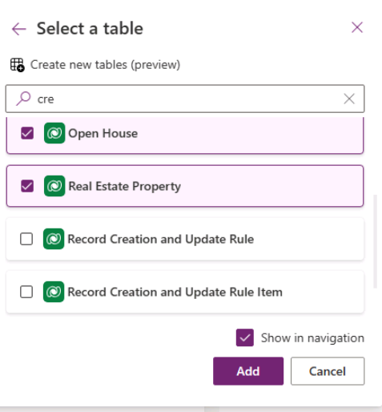
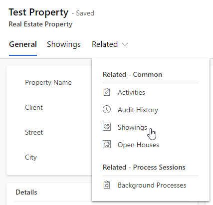

---
lab:
  title: 'Laboratorio 3: Crear una aplicación basada en modelo'
  module: 'Module 2: Get started with model-driven apps in Power Apps'
---

# Laboratorio de práctica 3: creación de una aplicación controlada por modelos

## Escenario

En este laboratorio, creará una aplicación controlada por modelos y agregará tablas a la aplicación.

Contoso Real Estate quiere realizar un seguimiento de dos elementos clave:

- Listados de propiedades inmobiliarias
- Quién tiene cita para visitar propiedades inmobiliarias

## Aprendizaje

- Cómo crear una aplicación controlada por modelos
- Cómo agregar tablas a la aplicación

## Pasos de alto nivel del laboratorio

- Crear una aplicación basada en modelo
- Agregar tablas a la aplicación
  
## Requisitos previos

- Debe de haber completado la práctica **Laboratorio 2: Modelo de datos**

## Pasos detallados

## Ejercicio 1: Compilación de una aplicación controlada por modelos

En este ejercicio, creará una aplicación controlada por modelos.

### Tarea 1.1: Creación de una aplicación de administración de propiedades

1. Vaya al portal de Power Apps Maker `https://make.powerapps.com`

1. Asegúrese de que está en el entorno **Dev One**.

1. Seleccione **Soluciones**.

1. Abra la solución **Descripciones de propiedades**.

1. Seleccione **+ Nuevo** y, a continuación, seleccione **App** y seleccione **Aplicación controlada por modelos**.

    

1. Escriba `Property Management` en **Nombre**.

1. Seleccione **Crear**.

    

### Tarea 1.2: Agregar tablas

1. Seleccione **+ Agregar página**.

    

1. Seleccione **Tabla de Dataverse**.

1. Escriba `cre` en **Búsqueda**.

    

1. Seleccione **Abrir casa**, **Propiedad inmobiliaria** y **Visita programada**.

1. Escriba `account` en **Buscar** y seleccione **Cuenta**.

1. Escriba `contact` en **Buscar** y seleccione **Contacto**.

1. Seleccione **Agregar**.

    

1. Seleccione **Guardar**.

1. Seleccione **Publish**.

### Tarea 1.3: Prueba

1. Con el diseñador de aplicaciones **Administración de propiedades** abierto, seleccione el botón **Reproducir**.

1. Vaya a **Contactos**.

1. Seleccione **+ Nuevo**.

1. Escriba `Jon` para **Nombre**.

1. Escriba `Doe` para **Apellidos**

1. Seleccione **Guardar y cerrar**.

1. Vaya a **Propiedades inmobiliarias**

1. Seleccione **+ Nuevo**.

1. Escriba `Test Property` para **Nombre de propiedad**.

1. Seleccione **Guardar**.

1. Seleccione **Relacionado** y **Visitas programadas**.

    

1. Seleccione **+ Nueva visita programada**.

1. Escriba `First Showing` en **Nombre**.

1. Seleccione **Guardar y cerrar**.

1. Seleccione **Guardar y cerrar**.

