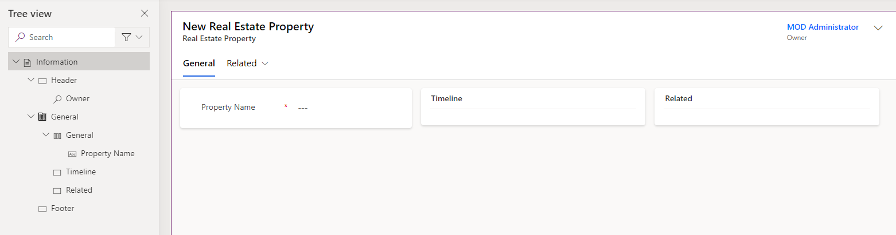
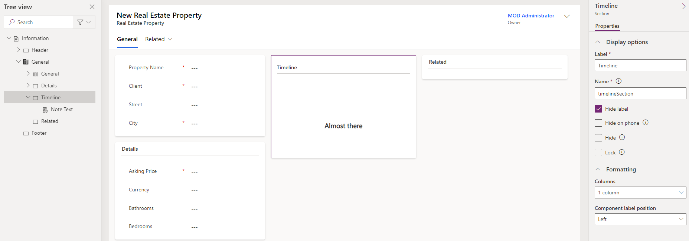

---
lab:
  title: "Laboratorio\_4: Configuración de formularios y vistas"
  module: 'Module 3: Configure forms, charts, and dashboards in model-driven apps'
---

# Laboratorio de práctica 4: Configuración de formularios y vistas

## Escenario

En este laboratorio, configurará formularios y vistas para una aplicación controlada por modelos.

Contoso Real Estate quiere realizar un seguimiento de dos elementos clave:

- Listados de propiedades inmobiliarias
- Quién tiene cita para visitar propiedades inmobiliarias

## Aprendizaje

- Configuración de formularios de tabla
- Configuración de vistas de tabla

## Pasos de alto nivel del laboratorio

- Configuración del formulario principal de la propiedad inmobiliaria y de las visitas
- Configuración de pestañas y secciones
- Adición de columnas a formularios
- Adición de una subcuadrícula
- Creación de formularios
- Asociación de roles de seguridad con formularios
- Configuración de las vistas de la propiedad inmobiliaria y de las visitas
- Filtrado de vistas
- Configuración de la vista de búsqueda rápida
  
## Requisitos previos

- Debe de haber completado la práctica **Laboratorio 2: Modelo de datos**

## Pasos detallados

## Ejercicio 1: Formulario principal de propiedad inmobiliaria

En este ejercicio, modificará el formulario principal de la tabla Propiedad inmobiliaria.

### Tarea 1.1: Diseño de formulario principal y columnas

1. Vaya al portal de Power Apps Maker `https://make.powerapps.com`

1. Asegúrese de que está en el entorno **Dev One**.

1. Seleccione **Soluciones**.

1. Abra la solución **Descripciones de propiedades**.

1. Seleccione la tabla **Propiedad inmobiliaria**.

1. En **Experiencias de datos**, seleccione **Formularios**.

1. Seleccione el formulario **Información** donde el **tipo de formulario** es **Principal**, seleccione el menú **Comandos** (...) y seleccione **Editar** > **Editar en nueva pestaña**.

1. Seleccione **Vista de árbol** en el lado izquierdo del diseñador de formularios.

1. Seleccione la pestaña **General**.

1. Escriba `generalTab` en **Nombre**.

1. En el panel **Propiedades** del lado derecho, seleccione **3 columnas** en la lista desplegable **Diseño**.

    

1. En la **vista de árbol**, expanda la pestaña **General**. Seleccione la primera sección y escriba `generalSection` en **Nombre**.

1. Seleccione la segunda sección y escriba `Timeline` en **Etiqueta** y `timelineSection` en **Nombre**.

1. Seleccione la tercera sección y escriba `Related` en **Etiqueta** y `relatedSection` en **Nombre**.

1. Arrastre el campo **Propietario** al área **Encabezado**.

    

1. Seleccione la primera sección.

1. Seleccione **Columnas de tabla** en el panel de navegación izquierdo del diseñador de formularios.

1. Arrastre la columna **Cliente** debajo del campo **Nombre de propiedad**.

1. Seleccione la columna **Calle** para agregar al formulario debajo de **Cliente**.

1. Seleccione la columna **Ciudad** para agregar al formulario debajo de **Calle**.

1. Seleccione **Componentes** en el panel de navegación izquierdo del diseñador de formularios.

1. Seleccione el control de **sección de 1 columna** para agregarlo al formulario.

1. Escriba `Details` en **Etiqueta** y `detailsSection` en **Nombre**.

1. Seleccione **Columnas de tabla** en el panel de navegación izquierdo del diseñador de formularios.

1. Seleccione la columna **Precio de venta** para agregarla a la sección Detalles.

1. Seleccione la columna **Moneda** para agregarla al formulario debajo de **Precio de venta**.

1. Seleccione la columna **Dormitorios** para agregarla al formulario debajo de **Moneda**.

1. Seleccione la columna **Baños** para agregarla al formulario debajo de **Dormitorios**.

    

### Tarea 1.2: Adición de un control de escala de tiempo

1. Seleccione **Vista de árbol** en el panel de navegación izquierdo del diseñador de formularios.

1. Seleccione la sección **Escala de tiempo**.

1. Seleccione **Componentes** en el panel de navegación izquierdo del diseñador de formularios.

1. Expanda **Mostrar**.

1. Seleccione el control **Escala de tiempo** para agregarlo a la sección **Escala de tiempo**.

1. Seleccione **Vista de árbol** en el panel de navegación izquierdo del diseñador de formularios, expanda la pestaña **General** y seleccione la sección **Escala de tiempo**.

1. En el panel **Propiedades** del lado derecho, active la casilla **Ocultar etiqueta**.

    

1. En la **Vista de árbol**, seleccione el control **Texto de nota** para la escala de tiempo.

1. En el panel **Propiedades** del lado derecho, seleccione **Actividad social**, desactive la casilla **Habilitar** y seleccione **Listo**.

1. En el panel **Propiedades** del lado derecho, seleccione **Fecha de creación** en la lista desplegable **Ordenar actividades por**.

1. Seleccione **Columnas de tabla** en el panel de navegación izquierdo del diseñador de formularios.

1. Arrastre la columna **Motivo de estado** al área **Encabezado**.

### Tarea 1.3: Adición de un control de vista rápida

1. Seleccione **Vista de árbol** en el lado izquierdo del diseñador de formularios.

1. Seleccione la sección **Relacionado**.

1. Seleccione **Componentes** en el panel de navegación izquierdo del diseñador de formularios.

1. Expanda **Mostrar**.

1. Seleccione el control **Vista rápida** para agregarlo a la sección **Relacionado**.

1. Seleccione **Cliente** para **Búsqueda** y **tarjeta de contacto de cuenta** para **Contacto** y seleccione **Listo**.

### Tarea 1.4: Adición de una pestaña

1. Seleccione **Componentes** en el panel de navegación izquierdo del diseñador de formularios.

1. Seleccione el control de **pestaña de 1 columna** para agregarlo al formulario.

1. Escriba `Showings` en **Etiqueta** y `showingTab` en **Etiqueta**.

1. Seleccione **Vista de árbol** en el lado izquierdo del diseñador de formularios, expanda la pestaña **Visitas** y seleccione la sección **Nueva sección**.

1. Escriba `Showings` en **Etiqueta** y `showingSection` en **Nombre**.

1. Seleccione **Componentes** en el panel de navegación izquierdo del diseñador de formularios.

1. Expanda la **Cuadrícula**.

1. Seleccione el control de **Subcuadrícula** para agregarlo a la sección **Visitas**.

1. Seleccione **Solo los registros relacionados**.

1. Seleccione **Visitas** para **Tabla** y **Visitas activas** para la **Vista predeterminada** y seleccione **Listo**.

1. Escriba `Showings` en **Etiqueta** y `showingsSG` en **Nombre**.

1. Seleccione **Ocultar etiqueta**.

1. Seleccione **Guardar y publicar**.

1. **Cierre** el diseñador de formularios.

## Ejercicio 2: Visualización del formulario principal

En este ejercicio, modificará el formulario principal de la tabla de Visita.

### Tarea 2.1: Diseño y columnas del formulario principal

1. Vaya al portal de Power Apps Maker `https://make.powerapps.com`

1. Asegúrese de que está en el entorno **Dev One**.

1. Seleccione **Soluciones**.

1. Abra la solución **Descripciones de propiedades**.

1. Seleccione la tabla **Visitas**.

1. En **Experiencias de datos**, seleccione **Formularios**.

1. Seleccione el formulario **Información** donde el **tipo de formulario** es **Principal**, seleccione el menú **Comandos** (...) y seleccione **Editar** > **Editar en nueva pestaña**.

1. Arrastre el campo **Propietario** al área **Encabezado**.

1. Seleccione **Columnas de tabla** en el panel de navegación izquierdo del diseñador de formularios.

1. Arrastre la columna **Propiedad inmobiliaria** debajo del campo **Nombre**.

1. Seleccione la columna **Se ha mostrado a** agregarla al formulario debajo de **Propiedad inmobiliaria**.

1. Seleccione la columna **Mostrada por** para agregarla al formulario debajo de **Se ha mostrado a**.

1. Seleccione la columna **Fecha de visita** para agregarla al formulario debajo de **Mostrada por**.

1. Seleccione la columna **Nivel de interés** para agregarla al formulario debajo de **Fecha de visita**.

1. Seleccione la columna **Comentarios** para agregarla al formulario debajo de **Nivel de interés**.

1. En el panel **Propiedades** del lado derecho, aumente la **altura del campo de formulario** a **3 filas**.

1. Seleccione **Guardar y publicar**.

1. **Cierre** el diseñador de formularios.

## Ejercicio 3: Varios formularios

En este ejercicio, creará un nuevo formulario y restringirá el acceso con un rol de seguridad.

### Tarea 3.1: Rol de seguridad

1. Vaya al portal de Power Apps Maker `https://make.powerapps.com`

1. Asegúrese de que está en el entorno **Dev One**.

1. Seleccione **Soluciones**.

1. Abra la solución **Descripciones de propiedades**.

1. Seleccione **+ Nuevo**, seleccione **Seguridad** y seleccione **Rol de seguridad**.

1. Escriba `Property admin` en **Nombre de rol**.

1. Seleccione la pestaña **Entidades personalizadas**.

1. Seleccione la tabla **Propiedad inmobiliaria** 4 veces para cambiar el nivel de acceso en todos los privilegios a **Organización**.

    

1. Seleccione la tabla **Visita** 4 veces para cambiar el nivel de acceso en todos los privilegios a **Organización**.

1. Seleccione **Guardar y cerrar**. De vuelta en la solución, seleccione **Listo** para recuperar los cambios.

### Tarea 3.2: Copia del formulario

1. Seleccione la tabla **Visitas**.

1. En **Experiencias de datos**, seleccione **Formularios**.

1. Seleccione el formulario **Información** donde el **tipo de formulario** es **Principal**, seleccione el menú **Comandos** (...) y seleccione **Editar** > **Editar en nueva pestaña**.

1. Seleccione **Nivel de interés** y, en el panel de Propiedades, seleccione **Solo lectura**.

1. Seleccione **Comentarios** y, en el panel de Propiedades, seleccione **Solo lectura**.

1. Seleccione **Guardar una copia**.

1. Escriba `Showing admin form` en **Nombre para mostrar** y seleccione **Guardar**.

    

1. Seleccione **Configuración del formulario**.

1. Seleccione el rol de seguridad **Administrador de propiedades**.

    

1. Seleccione **Guardar y publicar**.

1. **Cierre** el diseñador de formularios y seleccione **Listo**.

## Ejercicio 4: Vistas de propiedades inmobiliarias

En este ejercicio, modificará las vistas de la tabla Propiedad inmobiliaria.

### Tarea 4.1: Vista pública de la propiedad inmobiliaria

1. Vaya al portal de Power Apps Maker `https://make.powerapps.com`

1. Asegúrese de que está en el entorno **Dev One**.

1. Seleccione **Soluciones**.

1. Abra la solución **Descripciones de propiedades**.

1. Seleccione la tabla **Propiedad inmobiliaria**.

1. En **Experiencias de datos**, seleccione **Vistas**.

1. Seleccione la vista **Propiedades inmobiliarias activas**, seleccione el menú **Comandos** (...) y seleccione **Editar** > **Editar en la nueva pestaña**.

1. Seleccione el símbolo de intercalación junto a la columna **Creada en** y seleccione **Quitar**.

1. Seleccione la columna **Precio de venta** para agregarla a la vista.

1. Seleccione la columna **Ciudad** para agregarla a la vista.

1. Seleccione la columna **Dormitorios** para agregarla a la vista.

1. Seleccione la columna **Baños** para agregarla a la vista.

1. Seleccione la columna **Cliente** para agregarla a la vista.

1. En el panel Propiedades, quite **Nombre de propiedad** en **Ordenar por**.

1. En el panel Propiedades, seleccione **Ordenar por** y seleccione **Precio de venta**.

    

1. Seleccione **Guardar y publicar**.

1. **Cierre** el diseñador de vistas y seleccione **Listo**.

### Tarea 4.2: Vista de búsqueda rápida de propiedades inmobiliarias

1. Seleccione la vista **Búsqueda rápida de propiedades inmobiliarias**, seleccione el menú **Comandos** (...) y seleccione **Editar** > **Editar en la nueva pestaña**.

1. Seleccione el símbolo de intercalación junto a la columna **Creada en** y seleccione **Quitar**.

1. En el panel **Búsqueda rápida de propiedades inmobiliarias activas** a la derecha, seleccione **Editar columnas de la tabla de búsqueda** en **Buscar por **.

1. Elija las columnas siguientes y seleccione **Aplicar**.

    - Ciudad
    - Remoto
    - Nombre de propiedad

1. Seleccione **Guardar y publicar**.

1. **Cierre** el diseñador de vistas y seleccione **Listo**.

## Ejercicio 5: Vistas de visita

En este ejercicio, modificará las vistas de la tabla Visita.

### Tarea 5.1: Vista de la visita pública

1. Vaya al portal de Power Apps Maker `https://make.powerapps.com`

1. Asegúrese de que está en el entorno **Dev One**.

1. Seleccione **Soluciones**.

1. Abra la solución **Descripciones de propiedades**.

1. Seleccione la tabla **Visitas**.

1. En **Experiencias de datos**, seleccione **Vistas**.

1. Seleccione la vista **Visitas activas**, seleccione el menú **Comandos** (...) y seleccione **Editar** > **Editar en la nueva pestaña**.

1. Seleccione el símbolo de intercalación junto a la columna **Creada en** y seleccione **Quitar**.

1. Seleccione la columna **Propiedad inmobiliaria** para agregarla a la vista.

1. Seleccione la columna **Fecha de visita** para agregarla a la vista.

1. Seleccione la columna **Se ha mostrado a** para agregarla a la vista.

1. Seleccione la columna **Nivel de interés** para agregarla a la vista.

1. Seleccione la pestaña **Relacionado**.

1. Expanda **Propiedad inmobiliaria**.

1. Seleccione la columna **Precio de venta** para agregarla a la vista.

1. En el panel Propiedades, quite **Nombre** en **Ordenar por**.

1. En el panel Propiedades, seleccione **Ordenar por** y seleccione **Fecha de visita**.

1. En el menú desplegable **Guardar y publicar**, seleccione **Guardar solo**.

### Tarea 5.2: Vista de nueva visita

1. Seleccione **Guardar como**.

1. Escriba `High Interest showings` en **Nombre**.

1. Seleccione **Guardar**.

1. Seleccione el símbolo de intercalación junto a la columna **Nivel de interés** y seleccione **Filtrar por**.

1. Seleccione **Equivale a** y elija **Muy alto** y **Alto**.

1. Seleccione **Aplicar**.

1. Seleccione **Guardar y publicar**.

1. **Cierre** el diseñador de vistas y seleccione **Listo**.

