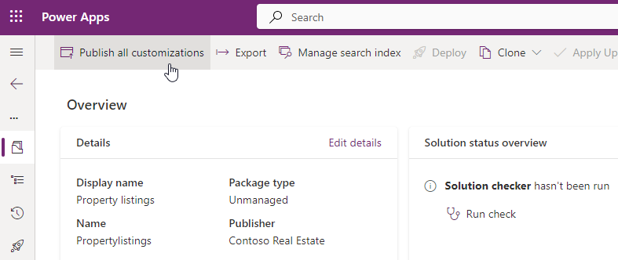

---
lab:
  title: "Laboratorio\_6: Exportación de la solución"
  module: 'Module 4: Manage solutions in Power Apps and Power Automate'
---

# Laboratorio de práctica 6: Exportación de la solución

## Escenario

En este laboratorio, exportará la solución

## Aprendizaje

- Cómo exportar una solución de Microsoft Dataverse

## Pasos de alto nivel del laboratorio

- Publica personalizaciones
- Ejecución del comprobador de soluciones
- Exportar solución
  
## Requisitos previos

- Debe de haber completado la práctica **Laboratorio 5: Configuración de aplicaciones basadas en modelos**

## Pasos detallados

## Ejercicio 1: Exportación de la solución

En este ejercicio, exportará la solución desde el entorno de desarrollo.

### Tarea 1.1: Publicación de cambios

1. Vaya al portal de Power Apps Maker `https://make.powerapps.com`

1. Asegúrese de que está en el entorno **Dev One**.

1. Seleccione **Soluciones**.

1. Seleccione la solución **Descripciones de propiedades**.

1. En la solución, seleccione la pestaña **Información general**.

    

1. Seleccione **Publicar todas las personalizaciones**.

### Tarea 1.2: Comprobador de soluciones

1. En la solución, seleccione la pestaña **Información general**.

1. Seleccione **Ejecutar comprobación** en **Información general sobre el estado de la solución**.

1. Espere unos minutos a que se complete el comprobador de soluciones.

    

1. No debería ver advertencias ni errores.

### Tarea 1.3: Exportación de una solución administrada

1. Seleccione **Exportar**.

1. Seleccione **Siguiente**.

1. Seleccione **Siguiente** de nuevo.

1. El número de versión debe haberse incrementado a **1.0.0.1**.

    

1. Seleccione **Administrada** para **Exportar como**.

1. Seleccione **Exportar**.

1. La exportación se preparará en segundo plano. Cuando la solución esté lista, seleccione el botón **Descargar**.

### Tarea 1.4: Exportación de una solución no administrada

1. Seleccione **Exportar**.

1. Seleccione **Siguiente**.

1. Seleccione **Siguiente** de nuevo.

1. El número de versión debe haberse incrementado a **1.0.0.2**.

1. Cambio del número de versión a `1.0.0.1`

1. Seleccione **No administrada** para **Exportar como**.

1. Seleccione **Exportar**.

1. La exportación se preparará en segundo plano. Cuando la solución esté lista, seleccione el botón **Descargar**.

